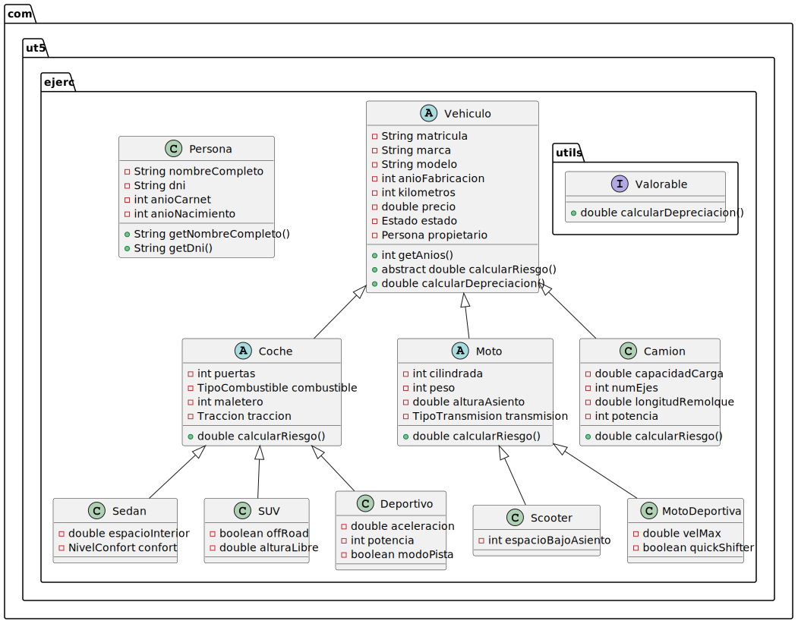

# UT5_ED_Prog

Checklist de la tarea:
- [x] Identificar jerarquías y clases abstractas
- [x] Definir atributos y visibilidad
- [x] Declarar métodos y operaciones (interfaz Valorable)
- [x] Modelar herencia, composición e implementación
- [x] Estructura de ficheros `.puml` correcta
- [x] Diagrama completado y exportado a SVG
- [x] Insertado en este README
- [x] (Opcional) Código Java subido en `src/`

